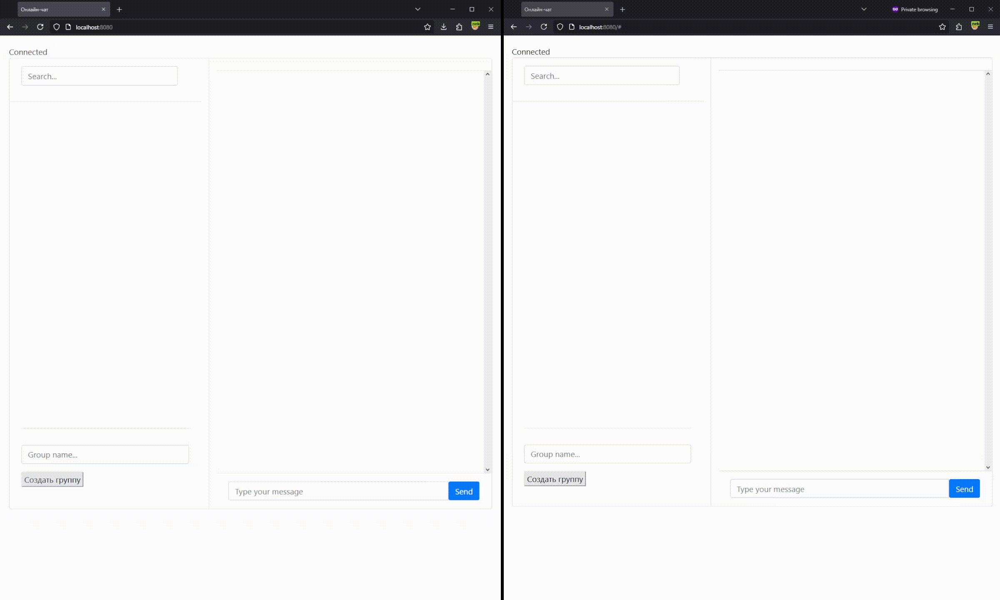
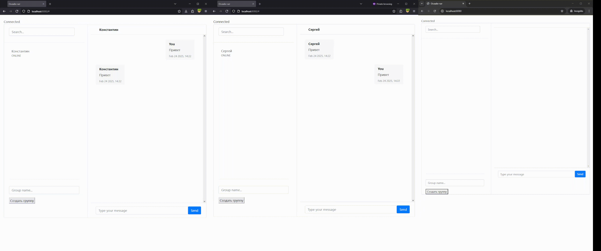

# Многопользовательский чат

Многопользовательский чат для личного и группового общения в реальном времени.

## Технологии

- **Java 17**
- **Maven**
- **Spring Boot 3**
  - **Spring Web**
  - **Spring WebSocket**
  - **Spring Security**
  - **Spring Data JPA**
  - **SpringDoc OpenAPI**
- **PostgreSQL**
- **Liquibase**
- **Thymeleaf**
- **Micrometer**
- **Prometheus**
- **Grafana**

## Функционал

- 🔐 **Регистрация и авторизация пользователей**
- 🔍 **Поиск пользователей**
- 💬 **Отправка личных сообщений**
- 👥 **Создание/поиск групп**
- ➕ **Вступление/выход из группы**
- 📢 **Отправка сообщений в группу**
- 🟢 **Мониторинг онлайн статуса пользователей**

## Примеры работы

### Личный чат



### Групповой чат



## Docker

```
docker pull ghcr.io/sapog87/yet-another-chat
```

## Environment Variables

| Переменная    | Описание                            | Пример значений |
|---------------|-------------------------------------|-----------------|
| `DB_HOST`     | Доменное имя сервера с базой данных | `example.com`   |
| `DB_PORT`     | Порт базы данных                    | `5432`          |
| `DB_NAME`     | Имя базы данных                     | `postgres`      |
| `DB_USERNAME` | Имя пользователя                    | `postgres`      |
| `DB_PASSWORD` | Пароль пользователя                 | `postgres`      |
| `SERVER_PORT` | Порт для приложение                 | `8080`          |
